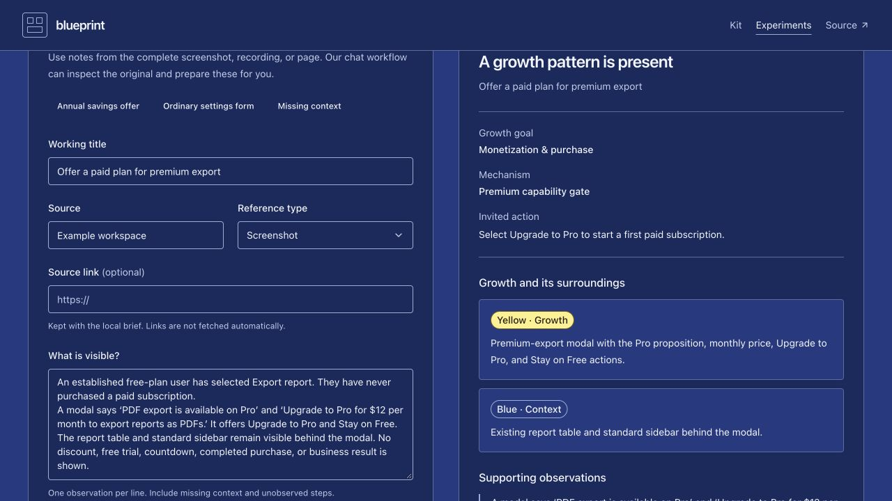

# Live curator verification

Verified on 4 October 2026 using the locally configured TypeSafe key and `jev-1.13.0`. All references below are fictional. No private reference media or account observations were submitted. Nothing was published.

## Observed results

| Case | Live result | Interpretation |
| --- | --- | --- |
| Profile settings | `context_only`; both components context; no growth goal, mechanism, action, or supporting evidence | Ordinary settings remain blue. |
| Cropped Continue button | `needs_review`; no established growth classification | Missing context is retained as uncertainty. |
| Annual savings at upgrade | Model admission `include`; final `needs_review`; plan framing, annual-billing action, observations o2/o3 supported | Primary goal split: expansion 0.72, monetization 0.27, unknown 0.01; confidence 0.68. No threshold was lowered to force admission. |
| Premium export offer to a free user | `include`; monetization; premium capability gate; offer modal growth, report/sidebar context | Yellow identifies the specific offer and blue preserves its environment. |

The four saved reports and their Markdown briefs remain under gitignored `local-curator/reviews/`. Their IDs are `00b4234c-376c-496a-88ca-04d7294b7e57`, `1af62196-3fba-48fb-b715-92a470e063ed`, `3c3aa3d9-d876-4e00-8d56-bc602d6ed549`, and `679c3f39-b61f-43a2-8183-7bc3e9931b7e`. An earlier direct annual-offer call also authenticated successfully while diagnosing the preview connection.

## Corrections prompted by verification

- Separated goal completeness from established component boundaries. The initial annual-offer report incorrectly displayed its strongly supported growth component as unclear because the goal was uncertain. The corrected composition preserves the yellow boundary while keeping final admission under review. A deterministic regression reproduces the observed goal split; the original live report remains unchanged as historical evidence.
- Malformed entries in observations, components, and actions now return an input error (400), rather than an upstream error (502).
- Kept the preview attached to a running terminal session so its network proxy remains available. Detached previews had inherited proxies that were no longer listening. The working preview for this review is port **5176**. Automatic approval review blocked stopping older preview processes; those were not forcibly terminated.

## Verification scope

The live interface displayed the annual-offer and premium-gate reports, evidence, component roles, and report actions. The premium report had no horizontal overflow at a 320-pixel viewport. Desktop proof below captures the full content viewport; the viewport override was reset after inspection.

`npm run curator:check` passes 16 deterministic tests, including the two corrections. The production build and token checks pass. These representative live cases verify connectivity, the response contract, and major result branches; they do not establish broad classification accuracy or calibrated confidence thresholds.

