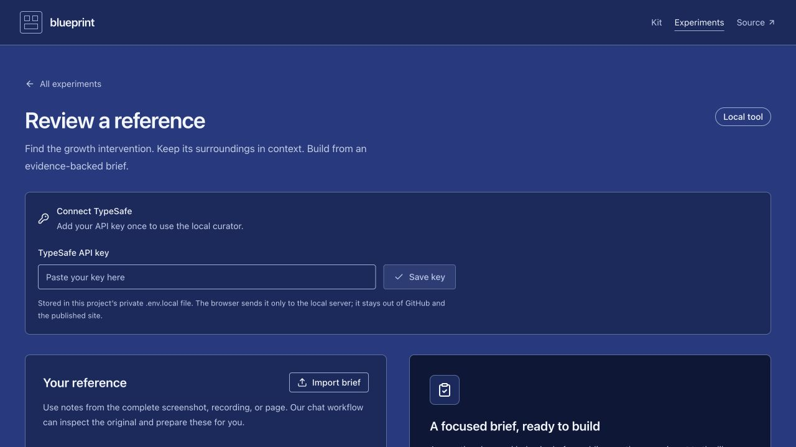

# Local growth curator review

Reviewed on 4 October 2026. This revision remains local; it has not been published.

The curator assesses extracted observations with TypeSafe/Jev and assembles a traceable brief: admission decision, goal, mechanism, visible target action, supporting observations, and yellow/blue component roles. It does not replace inspecting the original reference or completing the wireframe and index entry.

## Completed checks

- `npm run curator:check`: 15 deterministic tests passed using simulated API responses. These cover input and response validation, conservative admission, evidence requirements, explicit inclusion, retry behavior, and safe errors.
- `npm run build`: TypeScript, 308 contrast checks across 56 semantic roles, and the production build passed. Curator code, endpoints, and credentials are excluded from the published application.
- Local middleware checks with temporary fixtures covered same-origin restrictions, body limits, missing credentials, concurrent requests, private report persistence, and key saving. Saving a synthetic key preserved existing settings and did not reload the page or discard form content. Private environment files and temporary variants were inaccessible through Vite.
- Browser review covered the full desktop viewport, a 320-pixel mobile layout without horizontal overflow, the reference-kind selector, visible focus, fictional example loading, and returning to the index with the goal filter preserved.
- The real local review endpoint returned the expected `key_required` error while unconfigured. No live TypeSafe request was made.

## Remaining live check

Enter the API key through **Connect TypeSafe** in the local tool. Saving confirms configuration only. Run the three fictional examples against Jev, review their actual judgments and rendered reports, and record those results separately before claiming the live integration or model quality has been verified. Confidence thresholds remain provisional.

