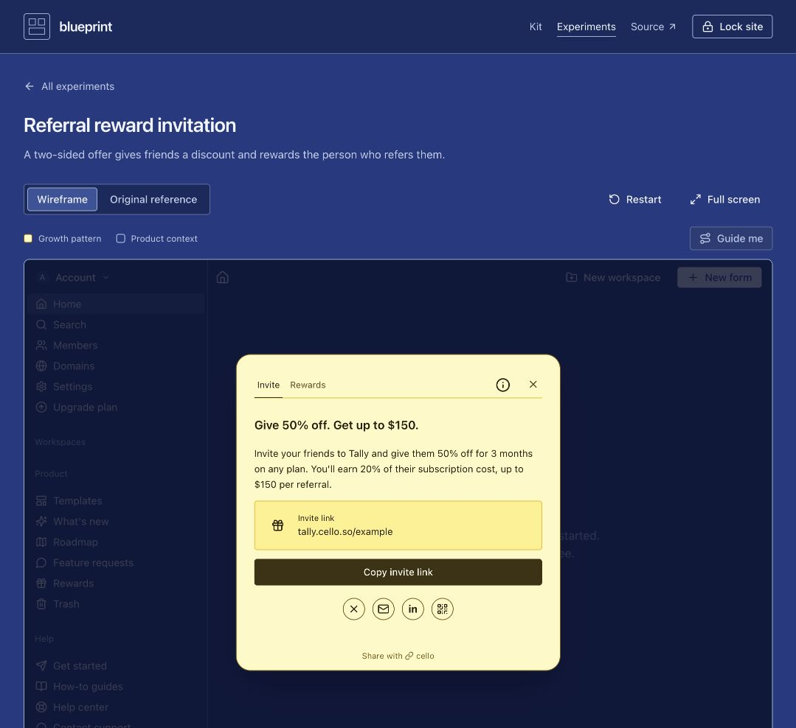

# Protected website release — 9 October 2026

Anuj requested publishing the latest revision to the existing protected website. The release includes five Tally experiments and eight original captures, complete yellow growth containers, the cleaned referral modal surface, Guide me focus restoration, and the interactive shared Blueprint logo.

## Deployment

- Website: https://blueprint-private-references.portfolio-v5.workers.dev/blueprint-wireframe-kit/
- Website Worker version: `fcd737ac-48ff-4297-a27d-c3009a019fce`.
- Internal search Worker version: `7283703f-2189-4f96-afce-5c24566e7d4a`.
- Search catalog: 28 experiments, including all five Tally entries.
- Protected originals: 59 total (38 ElevenLabs, 13 Cloudflare, 8 Tally).
- Existing password, session secret, quotas, service binding and GitHub Pages redirect retained. Originals and credentials remain gitignored.

## Completed verification

- Production build, 56 semantic token-role checks and 308 contrast-pair checks passed.
- All 18 gate tests and 8 search-worker tests passed. Both deployment dry runs passed.
- Source/build scan inspected 258 files and found no saved credentials or private-original bytes.
- Live anonymous HTML, JavaScript, CSS, recordings, originals, search and unknown paths returned 401 with only the password form.
- Valid login preserved the requested Tally route and reference-mode query, with the existing HttpOnly, Secure, SameSite=Lax one-hour cookie.
- All 59 live originals and all 35 live HTML/JS/CSS assets matched the respective local files exactly.
- Browser confirmed the Tally referral wireframe and original viewer; the original decoded at 1271 × 1108.
- One live Tally referral search returned `tally-referral-reward`.
- Modified cookies were denied; logout expired the session cookie.
- Pages remained redirect-only; its former original-image URL and the internal search service's public URL returned 404.
- A recording Range request returned 200 with the complete byte-identical 1,697,944-byte video. Cloudflare ignored Range in this live check; partial-response and seeking behavior were not verified. Gate range-forwarding tests passed.

The initial Python client required a CA bundle and was then rejected by Cloudflare with 403/1010. Final HTTP checks used system curl with normal certificate verification. No browser warning or authentication boundary was bypassed.

[Non-sensitive check results](release-check.json).
